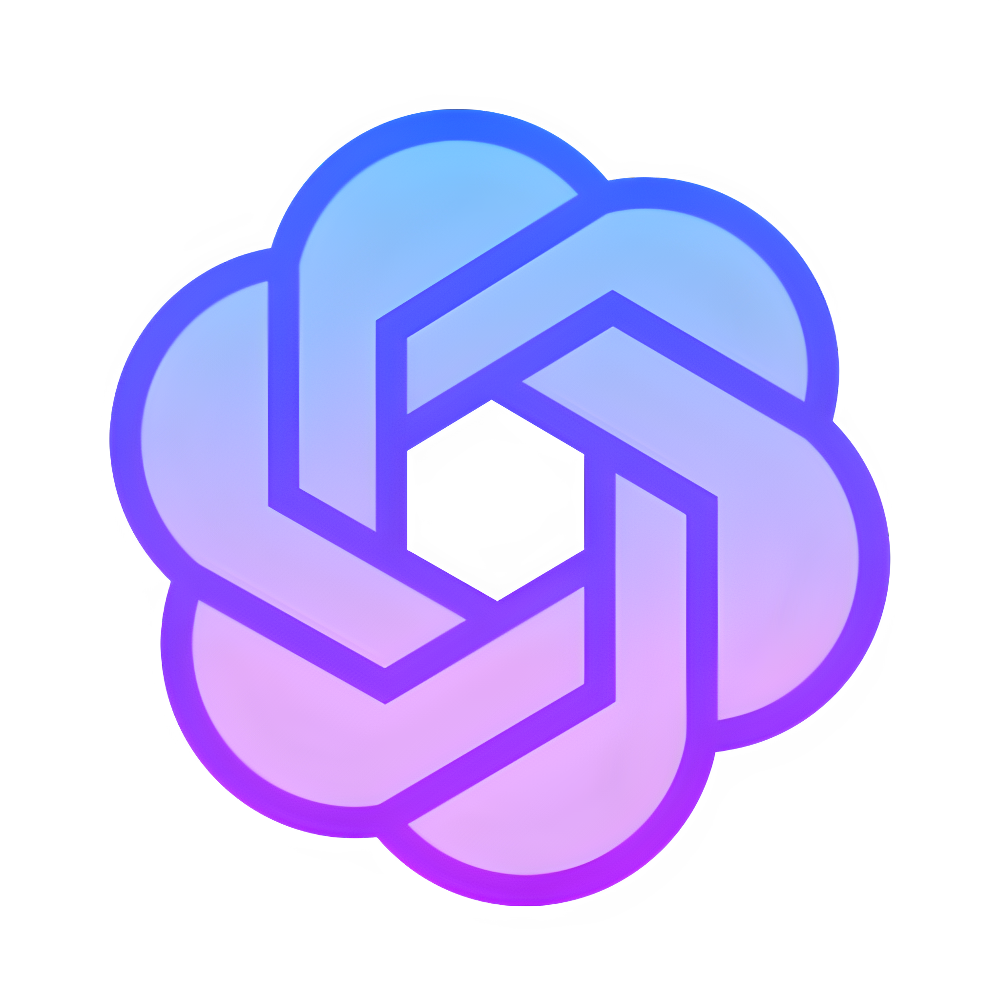
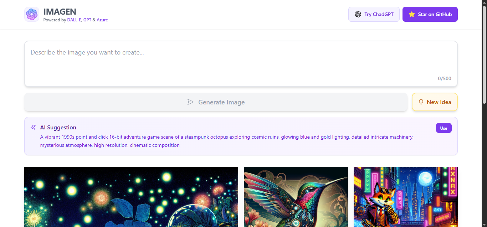
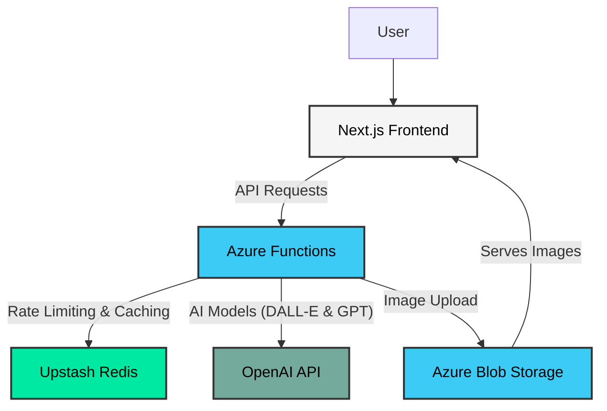

<div align="center">
  <a href="https://imagen.nabarun.app">
    
  </a>

  <h1 align="center">Imagen</h1>

  <p align="center">
    Say hello to your creative side!
    <br />
    <a href="https://imagen.nabarun.app"><strong>View Project »</strong></a>
    <br />
    <br />
    <a href="https://github.com/nabarvn/imagen/issues">Report Bug</a>
    •
    <a href="https://github.com/nabarvn/imagen/issues">Request Feature</a>
  </p>
</div>

## Overview

<div align="center">
  
</div>

<br />

Ever wanted to create a picture just by describing it? That's what Imagen does. Just type out your idea, and DALL-E will generate an image for you. If you're drawing a blank, don't worry – you can use our intelligent prompt suggestions to get some inspiration and see what you can create.

## Architecture

The diagram below illustrates the high-level architecture of the Imagen application.



## Running Locally

This project is split into two main parts: a Next.js frontend and an Azure Functions backend. Follow these steps to get both services running on your local machine.

### Prerequisites

This setup requires:

- [Node.js](https://nodejs.org/en) v20.14.0 ([nvm](https://github.com/nvm-sh/nvm) recommended)
- [Visual Studio Code](https://code.visualstudio.com/)
- [Azure Functions Core Tools](https://learn.microsoft.com/en-us/azure/azure-functions/functions-run-local) v4+ (can be installed via `npm install -g azure-functions-core-tools@4`)
- [Azure Functions for VS Code extension](https://marketplace.visualstudio.com/items?itemName=ms-azuretools.vscode-azurefunctions)
- An active [Azure account](https://azure.microsoft.com/en-us/free) (a free account is sufficient)

### 1. Cloning the Repository

First, clone the repository to your local machine:

```bash
git clone https://github.com/nabarvn/imagen.git
cd imagen
```

### 2. Backend Setup (Azure Functions)

The backend is powered by Azure Functions. We will use the VS Code extension to create the necessary cloud resources and configure our local environment.

1.  **Sign in to Azure**: Open the project in VS Code. Use the command palette (`Cmd+Shift+P` or `Ctrl+Shift+P`) to run the **`Azure: Sign In`** command and follow the prompts.

2.  **Create Azure Resources**:

    - In the VS Code command palette, run **`Azure Functions: Create Function App in Azure...`**.
    - The extension will guide you. Choose a unique name, select **`Node.js 20`** as the runtime, and pick a geographical region.
    - Crucially, when prompted, choose to **`+ Create new storage account`** and **`+ Create new resource group`**. This ensures everything is linked automatically.

3.  **Download Cloud Settings**:

    - Once the Function App is created, find it in the Azure extension sidebar under your subscription.
    - Expand its tree, right-click on **Application Settings**, and select **`Download Remote Settings...`**.
    - This will automatically create a `local.settings.json` file inside the `/azure` directory, pre-populated with the necessary connection string for your storage account.

4.  **Add API Keys**: Open the newly created `azure/local.settings.json` file. You need to add the following keys to the `Values` object.

| Variable Name              | Description                                     | Where to get it                                                            |
| :------------------------- | :---------------------------------------------- | :------------------------------------------------------------------------- |
| `OPENAI_API_KEY`           | Your secret API key for OpenAI.                 | Create one on the [OpenAI Platform](https://platform.openai.com/api-keys). |
| `UPSTASH_REDIS_REST_URL`   | The REST URL for your Upstash Redis database.   | Find this in your [Upstash Console](https://console.upstash.com/).         |
| `UPSTASH_REDIS_REST_TOKEN` | The REST token for your Upstash Redis database. | Find this in your [Upstash Console](https://console.upstash.com/).         |

### 3. Frontend Setup (Next.js)

The frontend needs to connect to your local backend and know the hostname of your Azure Storage Account to display the generated images.

1.  **Create Environment File**: In the root of the project, create a local environment file by copying the example.

    ```bash
    cp .env.example .env
    ```

2.  **Configure Storage Hostname**:
    - Open the newly created `.env` file.
    - In the `AZURE_STORAGE_HOSTNAME` variable, replace the placeholder `<your-storage-account-name>` with the actual name of the Storage Account you created earlier.
    - You can find your Storage Account name in the VS Code Azure extension sidebar.

### 4. Installing Dependencies

You will need two separate terminals to install dependencies for both the frontend and backend.

> **Note:** Run `nvm use` in the project root to switch to the compatible Node.js version (v20.14.0) before installing dependencies.

- **Terminal 1 (Root Directory):** Install frontend dependencies.

  ```bash
  npm install
  ```

- **Terminal 2 (`azure` Directory):** Install backend dependencies.

  ```bash
  cd azure
  npm install
  ```

### 5. Running the Application

- **Terminal 1 (Root Directory):** Start the frontend.

  ```bash
  npm run dev
  ```

- **Terminal 2 (`azure` Directory):** Start the backend.

  ```bash
  npm start
  ```

### 6. Accessing the Services

Once the services are running, you can access them at the following URLs:

- **Frontend**: [http://localhost:3000](http://localhost:3000)
- **Backend**: [http://localhost:7071](http://localhost:7071)

## Deployment

Once you have tested the application locally, you can deploy the backend to Azure.

1.  In VS Code, right-click the `azure` project folder.
2.  Select **`Deploy to Function App...`**.
3.  Choose the Function App you created during the setup process.
4.  A prompt should appear asking if you want to upload your settings. Click **`Upload`** to synchronize the API keys from your `local.settings.json` file to the cloud. This is a critical step.

Your API is now live! The frontend, when deployed to a service like Vercel, will need its `FUNCTION_APP_URL` environment variable updated to point to your new Azure Function App URL.

## Utility Scripts

You can manage the Redis database from your host machine by running the following commands from the `azure` directory:

- **Clear usage keys**:

  ```bash
  npm run clear-redis:usage
  ```

- **Clear rate limiting keys**:

  ```bash
  npm run clear-redis:rate
  ```

- **Clear all keys from the database**:

  ```bash
  npm run clear-redis:all
  ```

## Entire Tech Stack

### Frontend

- **Language**: [TypeScript](https://www.typescriptlang.org)
- **Framework**: [Next.js](https://nextjs.org)
- **Styling**: [Tailwind CSS](https://tailwindcss.com)
- **Data Fetching**: [SWR](https://swr.vercel.app/docs/getting-started)
- **Identification**: [FingerprintJS](https://fingerprint.com)
- **Deployment**: [Vercel](https://vercel.com)

### Backend

- **Language**: [TypeScript](https://www.typescriptlang.org)
- **Serverless Compute**: [Azure Functions](https://azure.microsoft.com/en-us/products/functions)
- **Blob Storage**: [Azure Blob Storage](https://azure.microsoft.com/en-us/services/storage/blobs)
- **Rate Limiting**: [Upstash Redis](https://upstash.com/docs/redis/overall/getstarted)
- **Usage Tracking**: [Upstash Redis](https://upstash.com/docs/redis/overall/getstarted)
- **LLM Provider**: [OpenAI](https://platform.openai.com/docs/overview)
- **Image Processing**: [Sharp](https://sharp.pixelplumbing.com)

<hr />

<div align="center">Don't forget to leave a STAR 🌟</div>
